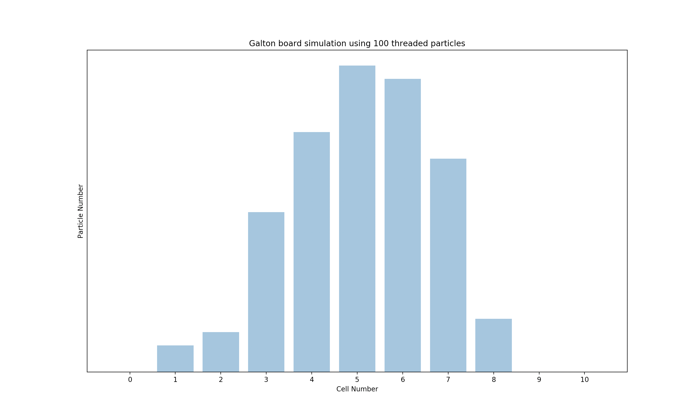
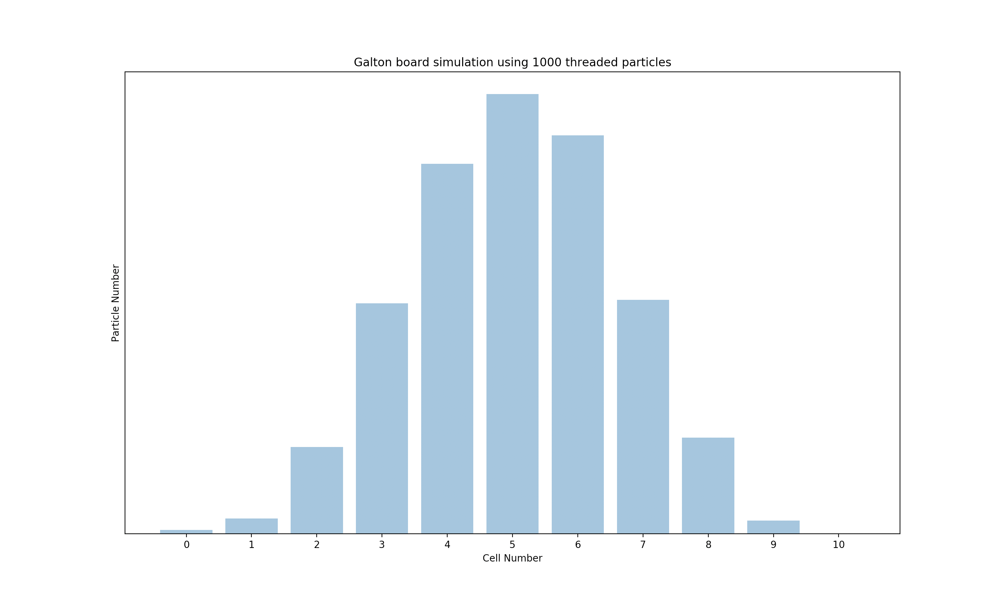
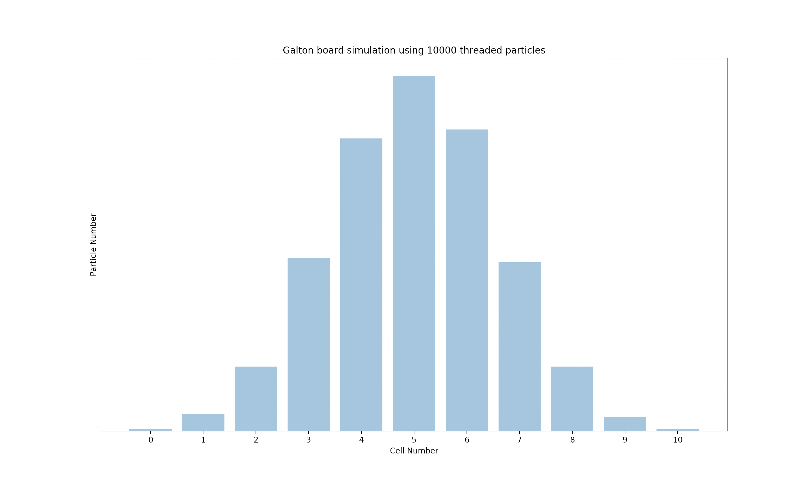

# Galton Board Simulations Using Multithreading

<p align="center"></p>

[[1]](#references) The Galton board, also known as a quincunx or bean machine, is a device for statistical experiments named after English scientist Sir Francis Galton. It consists of an upright board with evenly spaced nails (or pegs) driven into its upper half, where the nails are arranged in staggered order, and a lower half divided into a number of evenly-spaced rectangular slots. The front of the device is covered with a glass cover to allow viewing of both nails and slots. In the middle of the upper edge, there is a funnel into which balls can be poured, where the diameter of the balls must be much smaller than the distance between the nails. The funnel is located precisely above the central nail of the second row so that each ball, if perfectly centered, would fall vertically and directly onto the uppermost point of this nail's surface (Kozlov and Mitrofanova 2002). The figure above shows a variant of the board in which only the nails that can potentially be hit by a ball dropped from the funnel are included, leading to a triangular array instead of a rectangular one.

## Running

The simulator can be run using the command `python3 main.py`.
Note that in this case, the simulation will use the default the parameters. These parameters are as follows:

- Number of Particles: `1000`  
  Flag(s): `--particles`

- Number of Slots: `11`  
  Flag(s): `--slots`

- Start Position: `5`  
  Flag(s): `--position`

- Number of Levels: `5`  
  Flag(s): `--levels`

- Intermediate Results: `False`  
  Flag(s): `--intermediate` and `--no-intermediate`

- Plot: `False`  
  Flag(s): `--plot` and `--no-plot`

In order to specify the number of particles, number of slots of the board, the start position of
every particle, number of levels of pegs in the board, and whether to show intermediate results, one can use the commands below with the first command showing the intermediate results and the plot and the second one not showing them (note that the intermediate results and the plot functionalities are disabled by default as well).

The command below runs the simulation with 10000 particles, 13 slots, position 6 as the start position, 6 levels, and also displays the intermediate results along with the plot. Note that levels here really mean pairs of two rows of pegs (starting from the top/vertex peg).

```sh
python3 main.py --particles=10000 --slots=13 --start=6 --levels=6 --intermediate --plot
```

The command below runs the simulation with 10000 particles, 13 slots, position 6 as the start position, 6 levels, and does not display the intermediate results and the plot.

```sh
python3 main.py --particles=10000 --slots=13 --start=6 --levels=6 --no-intermediate --no-plot
```

The script above could be simplified by not passing the flags `--no-intermediate` and `--no-plot` and will become:

```sh
python3 main.py --particles=10000 --slots=13 --start=6 --levels=6
```

This is again due to the default behavior of `--intermediate` and `--plot` (which are set to `False` by default).

## Results

|          100 Threaded Particles           |           1000 Threaded Particles           |            10000 Threaded Particles            |
| :---------------------------------------: | :-----------------------------------------: | :--------------------------------------------: |
|  |  |  |

Results clearly show that as the number of particles increases, the distribution gets more and
more normal. This is a visual proof of what is called Central Limit Theorem or CLT which tells us that if the number of particles increases:

1. The mean gets closer to the center
2. The spread decreases
3. The distribution gets approximately normal

## Dependencies

- `Python 3.6+`
  - `Matplotlib`

## References

[1] [Galton Board -- from Wolfram MathWorld](http://mathworld.wolfram.com/GaltonBoard.html)

## License

[MIT License](LICENSE)
