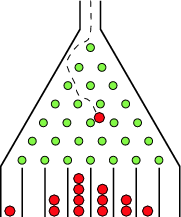

# Multithreaded Galton Board Simulations

<p align="center"></p>

[[1]](#references) The Galton board, also known as a quincunx or bean machine, is a device for
statistical experiments named after English scientist Sir Francis Galton. It consists of an upright
board with evenly spaced nails (or pegs) driven into its upper half, where the nails are arranged in
staggered order, and a lower half divided into a number of evenly-spaced rectangular slots. The
front of the device is covered with a glass cover to allow viewing of both nails and slots. In the
middle of the upper edge, there is a funnel into which balls can be poured, where the diameter of
the balls must be much smaller than the distance between the nails. The funnel is located precisely
above the central nail of the second row so that each ball, if perfectly centered, would fall
vertically and directly onto the uppermost point of this nail's surface (Kozlov and Mitrofanova
2002). The figure above shows a variant of the board in which only the nails that can potentially be
hit by a ball dropped from the funnel are included, leading to a triangular array instead of a
rectangular one.

## Dependencies

```console
$ python3 -m pip install -r requirements.txt
```

## API

```console
$ ./main.py --help
```

## Results

|           100 Threaded Particles           |           1000 Threaded Particles            |            10000 Threaded Particles            |
| :----------------------------------------: | :------------------------------------------: | :--------------------------------------------: |
|  |  |  |

Results clearly show that as the number of particles increases, the distribution gets more normal.
This is a visual proof of the Central Limit Theorem (CLT) which states that if the number of
particles increases:

1. The mean gets closer to the center
2. The spread decreases
3. The distribution gets approximately normal

## References

[1] [Galton Board -- from Wolfram MathWorld](http://mathworld.wolfram.com/GaltonBoard.html)

## License

[MIT License](LICENSE)
